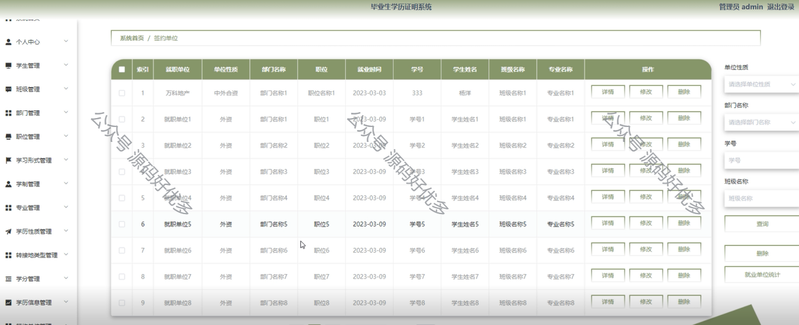

 
## 查看主页获取源码

> **作者介绍**： **✌**全网粉丝10W+本平台特邀作者、博客专家、CSDN新星计划导师、java领域优质创作者,博客之星、掘金/华为云/阿里云/InfoQ等平台优质作者、专注于项目实战 **✌**

  

### 一、作品包含

源码+数据库+设计文档万字+PPT+全套环境和工具资源+部署教程

### 二、项目技术

前端技术：Html、Css、Js、Vue、Element-ui

数据库：MySQL

后端技术：Java、Spring Boot、MyBatis

  

### 三、运行环境

开发工具：IDEA/eclipse

数据库：MySQL5.7

数据库管理工具：Navicat10以上版本

环境配置软件： JDK1.8+Maven3.6.3

前端Nodejs：14

### 四、项目介绍
项目编号：springbootA082

快速发展的社会中，人们的生活水平都在提高，生活节奏也在逐渐加快。为了节省时间和提高工作效率，越来越多的人选择利用互联网进行线上打理各种事务，然后线上管理系统也就相继涌现。与此同时，人们开始接受方便的生活方式。他们不仅希望页面简单大方，还希望操作方便，可以快速锁定他们需要的线上管理方式。基于这种情况，我们需要这样一个界面简单大方、功能齐全的系统来解决用户问题，满足用户需求。
课题主要分为二大模块：即管理员模块和学生模块，主要功能包括：个人信息修改、学生、班级、部门、职位、学习形式、学制、专业、学历性质、转接地类型、学分、学历信息、签约单位等

### 五、运行截图

  
